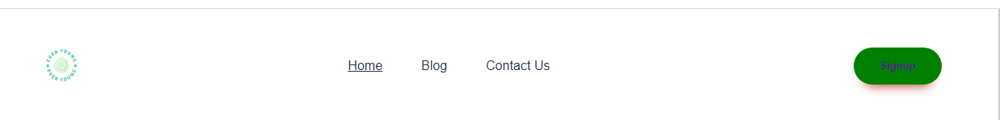
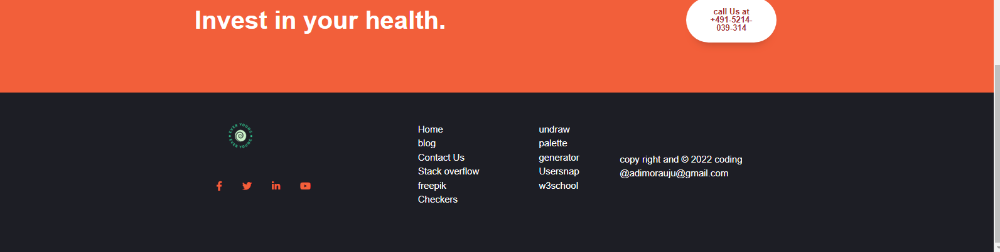
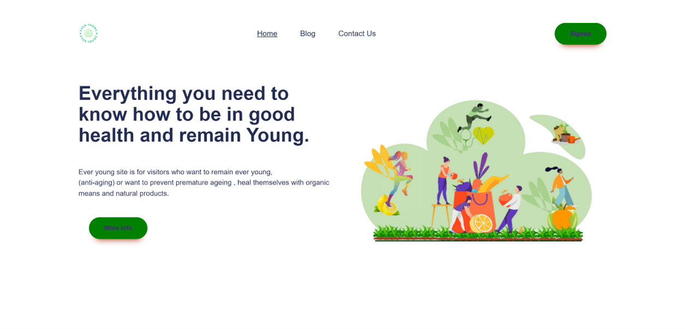
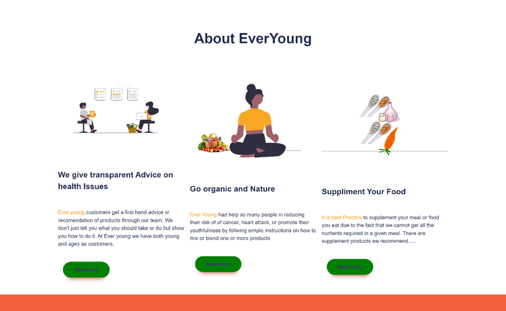
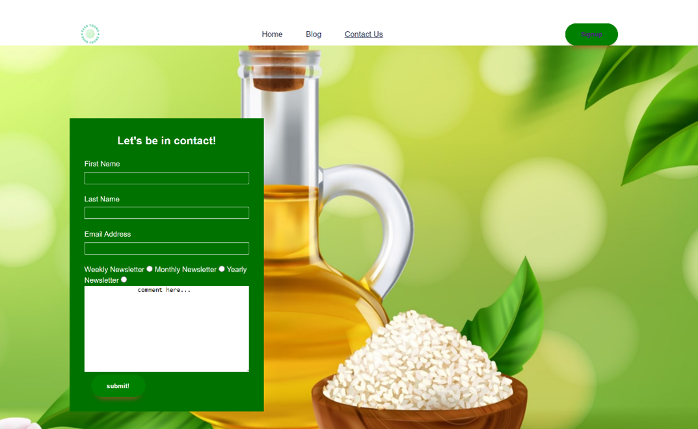
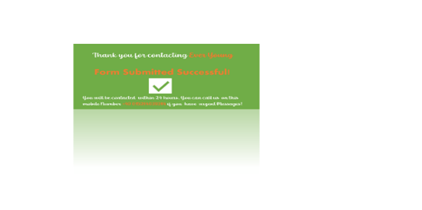
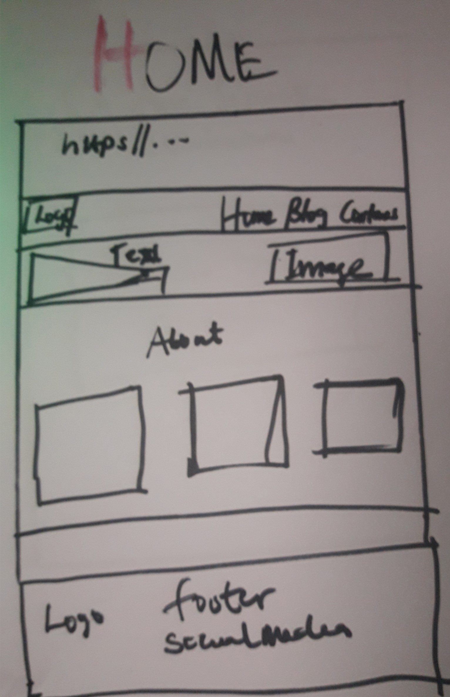
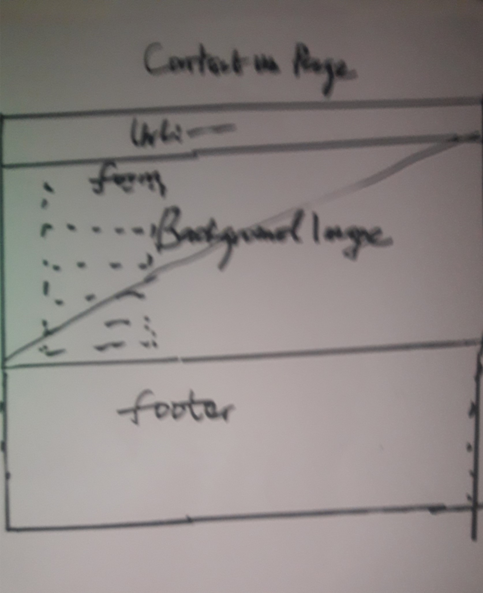
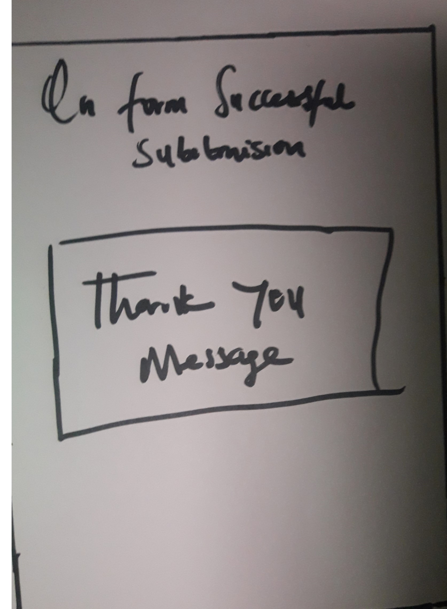
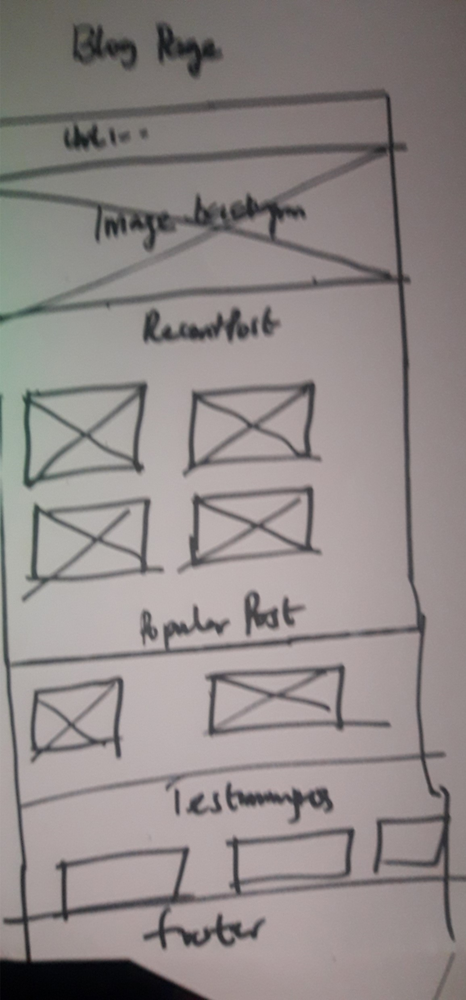

# Ever Young 

 80% of what we consumed on daily basis contribute a lot to the growth and development of man. This means what you eat today will determine what kind of sickness you will have tomorrow or how young youth you will appear. As a result, Ever Young website was created to help people or visitors/ users to determine what kinds of food/fruit/vegetable(organic) or products to eat for some kinds of illness and at the same time products to take for a longer youthfulness or to stop premature ageing.  The site has three pages; Home, Blog and Contact pages.
. View the live site here
 [here](https://8000-ujuadimoradev-everyoung-osb5vbbmw6p.ws-eu79.gitpod.io/index.html/)


## Features 

### Site wide
*	Navigation Menu
*	Contains links to the Home, Blog and Contact Us pages and will be responsive at 320px, 600px, , 50em. 1024px
*	This will allow users to easily navigate between the pages within the site on these sizes devices.




*	Footer
*	This will contain icons as links to social media websites that will open in new tabs. Icons will be accessible to the visually impaired who may be using a screen reader, by the use of aria labels. 
*	The social media link will allow the user to follow 'Ever Young' on various social media where they can get more up to date information that may not be displayed on the website. The contact information will allow the user to contact 'Ever Young' directly
*	The another  part of the footer  contain contact information for 'Ever Young' and  also contain some useful links that that provide good information( I acknowledge them) while creating this website.




### Landing Page
* Landing page image
* This will help to immediately show the user what the website is about and help to animate the page.



*	Website Information on 'Ever Young'
*	Information about '' and the website’s purpose including an image background.
*	This information lets the user know what the site is about.
*	There is Ever Young logo design by me. I used logo.com website (free site) to design it.
*	The landing background shows the user or the visitor that all business of taking quality nutrition and, be active and be healthy and strong.
*	 I design the background. I picked the illustration pictures from Microsoft power point picture and freepik.com and Undraw.co(free sites) 
*	Read more buttons will take you to read more about the Ever Young, but first you need to signup to be in contact with ‘Ever Young view the site’
	
*	The Home page is highlighted with a green background to show the page active and read me button with the green background show the consistency
 

* About Ever Young
* Below is the image About Ever Young.


* This section explains what Ever young is all about and is group in three categories;
1. Consultancy advice.
2. It has helped so many to recover their health through organic and natural means.
3. it also helped people through recommendation of useful food supplement.


Contact Us Page
This page shows the signup form

*	Contact form
*	This contact form is implemented to allow users to contact 'Ever Young' and as well sign up for newsletter( weekly, monthly or yearly) The form consist of the following fields and attributes:
*	First Name (required, type=text required)
*	Last Name (required, type=text required)
*	Email (required, type=email)
*	Comment (Message) , type=textarea)
*	On successful submission of the contact form, the user will be navigated to Thank _you.html displaying a success message.
*	This will allow users to contact 'Ever Young’ for consultancy service or enquiry about organic products or food supplement products  that have been listed in the blog. 






### Blog Page
* This page provides the user with vital information and tips for the total well being of the user. AS it can be seen at the Text on the background picture. It stated “your health  your wealth”  The is the directories of the organic  and  food supplement as well as  helpful tips of life.
The blog consists of ;
1.Background image that shows a woman having rest at the beach. I design the background the way it looks. I picked different pictures (pexel.com, pictures from Microsoft office gallery and assembled them together.
2. section showing Recent Post
3. Section showing Popular Post
4. Section showing users Testimonies
5. section showing social media which are in all three pages for consistency
6. There are read more that will take the user to sign up page if the use to know more about the particular product or the like


## Existent Features
*	Responsive design
*	There are some animations on the About Ever young
*	Contact form and thank you message page
*	There is a toggle button for the mobile. Java script was used because it cannot be done with only CSS.
*	There is also a button to call  and there is a an established connection


### Features Left to Implement

* 	As a future enhancement, the contact form will be updated with javascript to send an email to “Ever Young” with the contact 
    information.
*	There would be multiple pages for user to navigate to if they click more
*	There would be dedicated Twitter, you tube (demonstrate videos for products or Tips) and Facebook handle dedicated to Ever Young
*	There should Google map showing the location of Ever Young
*	It should be an Affiliate Marketing site for some sites in Future

## Design

###  Make sheet Wireframes
<br>
Home Page
<br><br>



<br><br>
Contact us Page
<br><br>





Blog page
<br><br>



## Technologies

* HTML
    * The structure of the Website was developed using HTML as the main language.
* CSS
    * The Website was styled using custom CSS in an external file.
* Visual Studio Code
    * The website was developed using Visual Studio Code IDE
* GitHub
    * Source code is hosted on GitHub and delpoyed using Git Pages.
* Git 
    * Used to commit and push code during the development opf the Website
* Font Awesome
    * Icons obtained from https://fontawesome.com/ were used as the Social media links in the footer section. 
* Tinyjpg
    * https://tinyjpg.com/ was used to reduce the size of the images used throughout the website


## Testing 

### Responsiveness

All pages were tested to ensure responsiveness on screen sizes from 320px and upwards as defined in [WCAG 2.1 Reflow criteria for responsive design](https://www.w3.org/WAI/WCAG21/Understanding/reflow.html) on Chrome, Edge, Firefox and Opera browsers.

Steps to test:

1. Open browser and navigate to [Ever Young](https://ujuadimoradev-everyoung-c57lkydkuuk.ws-eu79.gitpod.io//)
2. Open the developer tools (right click and inspect)
3. Set to responsive and decrease width to 320px
4. Set the zoom to 50%
5. Click and drag the responsive window to maximum width

Expected:

Website is responsive on all screen sizes and no images are pixelated or stretched.
No horizontal scroll is present.
No elements overlap.

Actual:

Website behaved as expected with the exception of switching to landscape view in Mozilla Firefox. Details can be found in [Unfixed Bugs](#Unfixed-Bugs)

Website was also opened on the following devices and no responsive issues were seen:

- Oukitel C21 Pro
- TCL 30 Pro
- iPhone SE
- Samsung Galaxy Tablet

### Accessibility

[Wave Accessibility](https://wave.webaim.org/) tool was used throughout development and for final testing of the deployed website to check for any aid accessibility testing.

Testing was focused to ensure the following criteria were met:

- All forms have associated labels or aria-labels so that this is read out on a screen reader to users who tab to form inputs
- Color contrasts meet a minimum ratio as specified in [WCAG 2.1 Contrast Guidelines](https://www.w3.org/WAI/WCAG21/Understanding/contrast-minimum.html)
- Heading levels are not missed or skipped to ensure the importance of content is relayed correctly to the end user
- All content is contained within landmarks to ensure ease of use for assistive technology, allowing the user to navigate by page regions
- All not textual content had alternative text or titles so descriptions are read out to screen readers
- HTML page lang attribute has been set
- Aria properties have been implemented correctly
- WCAG 2.1 Coding best practices being followed

Manual tests were also performed to ensure the website was accessible as possible and an accessibility issue was identified.

Issue : After keyboard controls were implemented, while testing the site with windows 'Narrator' screenreader, it was not clearly known what the purpose of the labels/checkboxes were. An aria-label label was added to the labels for screen readers to alert them that the labels were clickable and what their purpose was. Note:  I was only able to perfoem thise text of th e time factor.

### Lighthouse Testing


### Functional Testing

**Navigation Links**

Testing was performed to ensure all navigation links on the respective pages, navigated to the correct pages as per design. This was done by clicking on the navigation links on each page.

| Navigation Link | Page to Load    |
| --------------- | --------------- |
| Home            | index.html      |
| Blog            | blog.html |
| Contact Us      | signup.html    |

Links on all pages navigated to the correct pages as exptected.

**Form Testing**

The form on the contact Us page was tested to ensure it functioned as expected when correct data was input and when incorrect data was input. The following test scenarios were covered:

_Scenario One - Correct Inputs_

Steps to test:

1. Navigate to [Everjoung - Home Page](https://8000-ujuadimoradev-everyoung-c57lkydkuuk.ws-eu79.gitpod.io/index.html)
2. click the Contact us page  and fill in the  to the form and input the following data:
   - First Name: Uju
   - Last Name: Ada
   - Email: Ada.uju@test.com
   - Comment: This is super.( The commect is not a must requirement)
3. Click Submit
4. User should be redirected to Thank-you.html confirmation page as expected

Expected:

Form submits with no warnings or errors and the user is redirected to a thank-you.html confirmation page.

Actual:

The website behaved as expected with no errors or warnings and redirected to thanky-you.html.

_Scenario Two - Missing Required Field First Name_ or last Name or Email address. it will prompt   "Missing Required Field "

Steps to test:

1. Navigate to [Home - Ever Joung](https://8000-ujuadimoradev-everyoung-c57lkydkuuk.ws-eu79.gitpod.io/index.html)
2. Scroll down to the form and input the following data:
   - First Name:
   - Last Name: Doe
   - Email: doe.john@test.com
   - Comment: This is a test.
3. Click Submit

Expected:

The form does not submit and an Error is displayed to tell the user that the field is required.

Actual:

Website behaved as expected, error message was displayed and the form did not submit.

_Scenario Three - Missing Required Field Last Name_

Steps to test:

1. Navigate to [Home - Ever Young](https://8000-ujuadimoradev-everyoung-c57lkydkuuk.ws-eu79.gitpod.io/index.html)
2. Scroll down to the form and input the following data:
   - First Name:John
   - Last Name:
   - Email: doe.john@test.com
   - Comment: This is a test.
3. Click Submit

Expected:

The form does not submit and an Error is displayed to tell the user that the field is required.

Actual:

Website behaved as expected, error message was displayed and the form did not submit.

_Scenario Four - Missing Required Field Email_

Steps to test:

1. Navigate to [Ever young - Home Page](https://gareth-mcgirr.github.io/tacos-travels/index.html)
2. Scroll down to the form and input the following data:
   - First Name:John
   - Last Name: Doe
   - Email:
   - Comment: This is a test.
3. Click Submit

Expected:

The form does not submit and an Error is displayed to tell the user that the field is required.
That  means if you did not fill in any field ( except comment) or incorected filled email address- It will prompt you

See below;

_Scenario  - Incorrect email format_

Steps to test:

1. Navigate to [Ever Young - Home Page](https://8000-ujuadimoradev-everyoung-c57lkydkuuk.ws-eu79.gitpod.io/index.html)
2. Scroll down to the form and input the following data:
   - First Name:uju
   - Last Name: Ada
   - Email: ada.ujujoung.com
   - Comment: Perfect.
3. Click Submit

Expected:

The form does not submit and an Error is displayed to tell the user that a valid email is required and the format it should be in.

Actual:

Website behaved as expected.

**Footer Social Media Icons / Links**

Testing was performed on the Font Awesome Social Media icons in the footer to ensure that each one opened in a new tab and that each one had a hover affect of the orange branding color.

Each item opened a new tab when clicked as expected and correct hover color was present.

**Footer Contact Information**

Testing was performed on the phone number in the contact information section of the footer to ensure behaviour was as expected.

_Steps to test Telephone Number_

1. Navigate to [Ever Young - Home Page](https://8000-ujuadimoradev-everyoung-c57lkydkuuk.ws-eu79.gitpod.io/index.html)
2. Click the phone number in the footer area (+49 152 140 393914)

Expected:

A window is opened asking which device you would like to call from.

Actual:

Behavior was as expected and the window presented me with the following option to call:


### Validator Testing 

- HTML
  - No errors were returned when passing through the official [W3C validator](https://validator.w3.org)


- CSS
  - No errors were found when passing through the official [(Jigsaw) validator](https://jigsaw.w3.org)


### Unfixed Bugs
Responsiveness of the website worked on all devices, screen sizes and orientation with the exception of landscape orientation on mozilla firefox. I was unable to resolve this bug on time but will address in a future release.

## Deployment

### Version Control

The site was created using the Visual Studio code editor and pushed to github to the remote repository ‘tacos-travels’.

The following git commands were used throughout development to push code to the remote repo:

```git add <file>``` - This command was used to add the file(s) to the staging area before they are committed.

```git commit -m “commit message”``` - This command was used to commit changes to the local repository queue ready for the final step.

```git push``` - This command was used to push all committed code to the remote repository on github.

### Deployment to Github Pages

- The site was deployed to GitHub pages. The steps to deploy are as follows: 
  - In the GitHub repository, navigate to the Settings tab 
  - From the menu on left select 'Pages'
  - From the source section drop-down menu, select the Branch: main
  - Click 'Save'
  - A live link will be displayed in a green banner when published successfully. 

The live link can be found here - https://ujuadimoradev-everyoung-c57lkydkuuk.ws-eu79.gitpod.io/

### Clone the Repository Code Locally

Navigate to the GitHub Repository you want to clone to use locally:

- Click on the code drop down button
- Click on HTTPS
- Copy the repository link to the clipboard
- Open your IDE of choice (git must be installed for the next steps)
- Type git clone copied-git-url into the IDE terminal

The project will now of been cloned on your local machine for use.


## Credits 


* (https://www.w3schools.com/)
    *  some of the code was used from this site to create the blog. Styles were changed to suit styling on my Website. I recommend this site for every beginners.

   * https://stackoverflow.com]This site also help me in resovlving some issue in coding
    
* [Youtube column, grid, media queries Tutorial](https://youtu.be/sKFW3wek21Q),https://youtu.be/zyNhxN6sToM
    * I learn  lot from this video especially the  responsive of the website and CSS- I used some code but style differently.


### Content 

All contents and  media or image in this site was Fantasy( all are fantasied by me ) with the helps of these sites, I had mentioned  in the footer of this site ( some of the pictures or images are from these sites: Freeipks, Undraw, MS office  pictures garllery )

### Media

Website Logo was created by my me [Adimora Uju](adimorauju@gmail.com) using logo.com(a free website).

